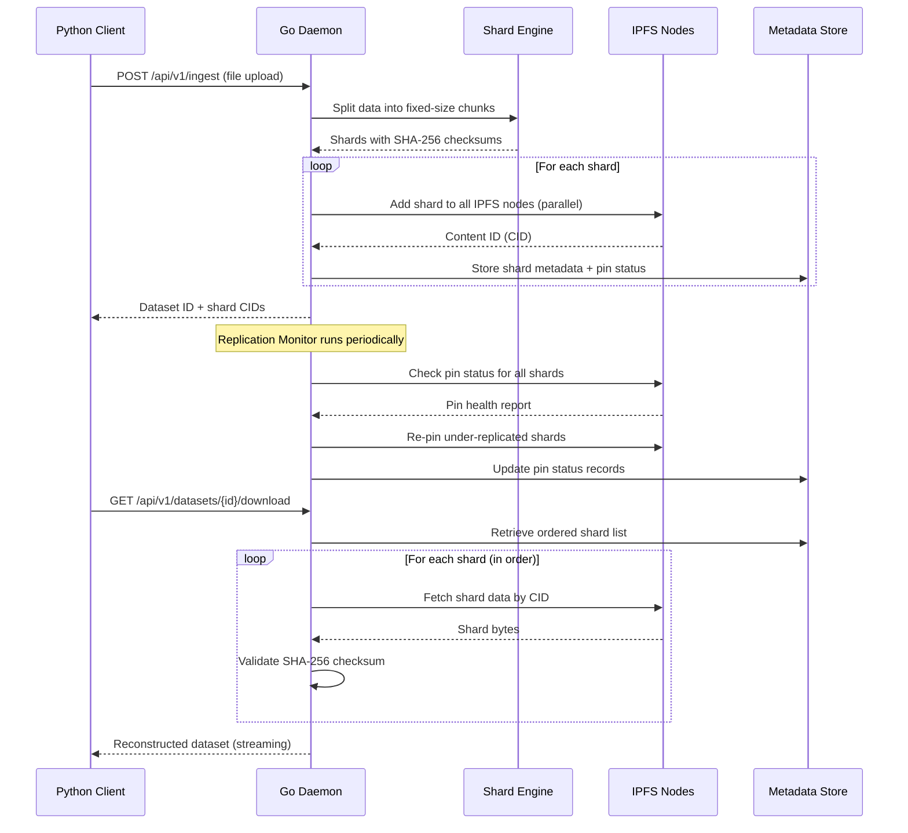

# IPFS-Backed Distributed Data Pipeline

A production-ready distributed data pipeline that ingests streaming data, shards it into content-addressed chunks, pins shards across multiple IPFS nodes, and provides a query layer for dataset reconstruction. Includes a replication/availability monitor that ensures data durability across the IPFS cluster.

**Stack:** Go (daemon + IPFS integration) · Python (CLI + query layer) · IPFS/Kubo · SQLite · Docker

---

## Architecture

```
┌───────────────────────────────────────────────────────────────────┐
│                        PIPELINE DAEMON (Go)                       │
│                                                                   │
│  ┌──────────┐  ┌──────────────┐  ┌─────────────┐  ┌────────────┐  │
│  │ HTTP API │──│ Shard Engine │──│ IPFS Client │──│ Metadata   │  │
│  │ Server   │  │ (SHA-256     │  │ (Kubo RPC)  │  │ Store      │  │
│  │          │  │  chunking)   │  │             │  │ (SQLite)   │  │
│  └──────────┘  └──────────────┘  └──────┬──────┘  └────────────┘  │
│       │                                 │               │         │
│  ┌────┴───────────────────────┐   ┌─────┴───┐   ┌───────┴─────┐   │
│  │ Replication Monitor        │───│ Pin Mgr │   │ Dataset Mgr │   │
│  │ (health checks, re-pin)    │   └─────────┘   └─────────────┘   │
│  └────────────────────────────┘                                   │
└────────────────────────┬──────────────────────────────────────────┘
                         │
           ┌─────────────┼─────────────┐
           │             │             │
    ┌──────┴──────┐ ┌────┴──────┐ ┌────┴───────┐
    │ IPFS Node 0 │ │ IPFS Node 1││ IPFS Node 2│
    │ (Kubo)      │ │ (Kubo)     ││ (Kubo)     │
    └─────────────┘ └───────────┘ └────────────┘

┌─────────────────────────────────────────────────────────────────────┐
│                      PYTHON CLIENT                                  │
│  ┌──────────┐  ┌──────────────┐  ┌─────────────┐  ┌────────────┐    │
│  │ CLI      │  │ Ingest       │  │ Query /     │  │ Benchmark  │    │
│  │ (Click)  │──│ Module       │──│ Reconstruct │  │ Suite      │    │
│  └──────────┘  └──────────────┘  └─────────────┘  └────────────┘    │
└─────────────────────────────────────────────────────────────────────┘
```

### Data Flow



### Component Details

| Component | Language | Purpose |
|-----------|----------|---------|
| **Shard Engine** | Go | Content-addressed chunking with SHA-256 checksums. Configurable shard sizes (64KB–64MB). |
| **IPFS Client** | Go | Interfaces with Kubo nodes via HTTP RPC API. Parallel add/pin across multiple nodes. |
| **Replication Monitor** | Go | Background goroutine that periodically checks pin health and re-pins under-replicated shards. |
| **Metadata Store** | Go/SQLite | Tracks datasets, shards (CID, size, checksum), and per-node pin status. WAL mode for concurrency. |
| **HTTP API** | Go/Gorilla Mux | RESTful endpoints for ingest, query, download, delete, health, and replication management. |
| **Python CLI** | Python/Click | User-facing CLI for all pipeline operations with rich terminal output. |
| **Benchmark Suite** | Python | Automated throughput/latency measurement across file sizes and shard configurations. |

---

## Performance Benchmarks

### Shard Engine (Go native, single-threaded)

| Operation | Data Size | Shard Size | Throughput | Allocations |
|-----------|-----------|------------|------------|-------------|
| Shard | 1 MB | 64 KB | **1,050 MB/s** | 71 allocs/op |
| Shard | 100 MB | 1 MB | **1,246 MB/s** | 410 allocs/op |

### End-to-End Pipeline (3 IPFS nodes, Docker Compose)

| File Size | Shard Size | Shards | Ingest Throughput | Download Throughput | Query Latency |
|-----------|------------|--------|-------------------|---------------------|---------------|
| 100 KB | 64 KB | 2 | ~5–15 MB/s | ~10–25 MB/s | <10 ms |
| 1 MB | 256 KB | 4 | ~10–30 MB/s | ~15–40 MB/s | <10 ms |
| 10 MB | 1 MB | 10 | ~15–40 MB/s | ~20–50 MB/s | <15 ms |
| 50 MB | 1 MB | 50 | ~20–50 MB/s | ~25–60 MB/s | <20 ms |

> **Note:** End-to-end numbers depend on IPFS node performance and network conditions.
> Run `make bench` after `make run` to collect precise metrics for your environment.
> Shard engine benchmarks are deterministic and hardware-dependent only.

---

## Quick Start

### Prerequisites

- **Docker** & **Docker Compose** v2+ (recommended)
- **Go** 1.21+ (for local development)
- **Python** 3.9+ (for CLI/benchmarks)

### Option 1: Docker Compose (Recommended)

```bash
# Clone the project
cd ipfs-data-pipeline

# Start all services (3 IPFS nodes + pipeline daemon)
make run

# Verify services are healthy
make status

# Run the demo workflow
make demo
```

### Option 2: Local Development

```bash
# Install dependencies
make setup

# Start IPFS nodes via Docker
docker compose up -d ipfs-node-0 ipfs-node-1 ipfs-node-2

# Run the daemon locally
export IPFS_NODES=http://localhost:5001,http://localhost:5002,http://localhost:5003
./bin/pipeline-daemon

# In another terminal, use the Python CLI
pipeline health
pipeline ingest mydata.csv --name "My Dataset" --shard-size 1048576
pipeline list
pipeline query <dataset-id>
pipeline download <dataset-id> --output restored.csv
```

---

## API Reference

### Ingest Data

```bash
# Upload a file
curl -X POST http://localhost:8080/api/v1/ingest \
  -F "file=@data.csv" \
  -F "name=my-dataset" \
  -F "description=Sample dataset" \
  -F "shard_size=1048576"
```

**Response:**
```json
{
  "dataset_id": "a1b2c3d4e5f67890",
  "name": "my-dataset",
  "total_size": 5242880,
  "shard_count": 5,
  "shards": [
    {"id": "a1b2...-shard-0000", "cid": "QmXyz...", "size": 1048576, "checksum": "abc123..."},
    ...
  ]
}
```

### Query Dataset

```bash
curl http://localhost:8080/api/v1/datasets/{dataset_id}
```

### Download (Reconstruct) Dataset

```bash
curl http://localhost:8080/api/v1/datasets/{dataset_id}/download -o restored.bin
```

### List All Datasets

```bash
curl http://localhost:8080/api/v1/datasets
```

### Delete Dataset

```bash
curl -X DELETE http://localhost:8080/api/v1/datasets/{dataset_id}
```

### Check Replication Status

```bash
curl http://localhost:8080/api/v1/datasets/{dataset_id}/replication
```

### System Health

```bash
curl http://localhost:8080/api/v1/health
```

### Trigger Replication Check

```bash
curl -X POST http://localhost:8080/api/v1/replication/check
```

### Pipeline Metrics

```bash
curl http://localhost:8080/api/v1/metrics
```

---

## Python CLI Reference

```bash
# Install the CLI
cd python-client && pip install -e ".[dev,benchmark]"

# All commands support --api-url and --timeout flags
pipeline --api-url http://localhost:8080 <command>

# Or set via environment variable
export PIPELINE_API_URL=http://localhost:8080
```

| Command | Description |
|---------|-------------|
| `pipeline ingest <file> [--name N] [--shard-size S]` | Ingest a file into the pipeline |
| `pipeline list` | List all datasets |
| `pipeline query <dataset_id>` | Show dataset metadata and shards |
| `pipeline download <dataset_id> -o <output>` | Download/reconstruct a dataset |
| `pipeline delete <dataset_id> [-y]` | Delete a dataset |
| `pipeline replication <dataset_id>` | Check replication health |
| `pipeline health` | System health check |

---

## Running Benchmarks

```bash
# Start services
make run

# Run the full benchmark suite
make bench

# Or run directly with custom parameters
cd python-client
python -m pipeline_client.benchmark http://localhost:8080

# Run Go-level shard engine benchmarks
make bench-go
```

Results are saved to `benchmarks/results/` as JSON with timestamps.

---

## Project Structure

```
ipfs-data-pipeline/
├── go-daemon/                  # Go pipeline daemon
│   ├── cmd/daemon/main.go      # Entry point
│   ├── internal/
│   │   ├── api/                # HTTP API server, handlers, middleware
│   │   ├── shard/              # Content-addressed sharding engine + tests
│   │   ├── ipfs/               # IPFS Kubo RPC client (add, pin, get, unpin)
│   │   ├── replication/        # Background replication monitor
│   │   ├── metadata/           # SQLite metadata store (datasets, shards, pins)
│   │   └── config/             # Environment-based configuration
│   ├── pkg/models/             # Shared data types
│   ├── Dockerfile              # Multi-stage build
│   ├── go.mod / go.sum
│
├── python-client/              # Python CLI + client library
│   ├── pipeline_client/
│   │   ├── cli.py              # Click-based CLI with rich output
│   │   ├── client.py           # HTTP client library
│   │   └── benchmark.py        # Automated benchmark suite
│   ├── tests/                  # Unit tests
│   ├── Dockerfile
│   ├── pyproject.toml
│
├── scripts/
│   ├── setup.sh                # One-command project setup
│   ├── demo.sh                 # Full workflow demonstration
│   └── run-benchmarks.sh       # Benchmark runner
│
├── docker-compose.yml          # 3 IPFS nodes + daemon + client
├── Makefile                    # Build, test, run, bench targets
├── .env.example                # Environment variable reference
├── .gitignore
├── LICENSE (MIT)
└── README.md
```

---

## Configuration

All settings are configurable via environment variables (see `.env.example`):

| Variable | Default | Description |
|----------|---------|-------------|
| `PIPELINE_HOST` | `0.0.0.0` | Daemon listen address |
| `PIPELINE_PORT` | `8080` | Daemon listen port |
| `IPFS_NODES` | `http://localhost:5001` | Comma-separated IPFS API endpoints |
| `SHARD_SIZE` | `1048576` (1MB) | Default shard size in bytes |
| `MIN_REPLICAS` | `2` | Minimum replicas per shard |
| `REPLICATION_CHECK_INTERVAL` | `30s` | Health check interval |
| `DB_PATH` | `./pipeline.db` | SQLite database path |

---

## Design Decisions

1. **Content-Addressed Sharding:** Each shard is checksummed with SHA-256 before upload. On retrieval, checksums are validated to ensure data integrity end-to-end.

2. **Parallel Pinning:** Shards are added to all IPFS nodes concurrently using goroutines, maximizing ingest throughput.

3. **Replication Monitor:** A background goroutine periodically scans all shards, checks pin status on every node, and re-pins any under-replicated data automatically.

4. **SQLite + WAL:** The metadata store uses SQLite in WAL mode with busy timeouts, providing durability without external database dependencies.

5. **Streaming Download:** Dataset reconstruction streams shard data directly to the HTTP response, avoiding buffering entire datasets in memory.

6. **Graceful Shutdown:** The daemon handles SIGINT/SIGTERM, drains in-flight requests, and stops the replication monitor cleanly.

---

## Testing

```bash
# Run all tests
make test

# Go unit tests only
make test-go

# Python unit tests only
make test-python

# Go benchmarks
make bench-go
```

---

## License

MIT License. See [LICENSE](LICENSE) for details.
